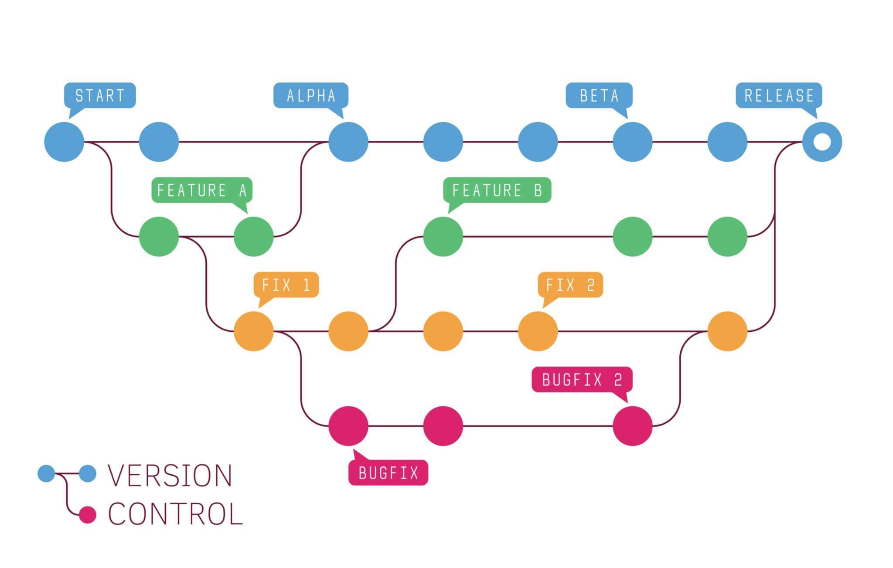

# What is git?
**git** is a version control system
- *What is a Version Control System?*\
essentially a tool for tracking changes made to files to over time. (don't worry about the technicalities just understand this concept)

so in this case git is just an <u>open source version control system where developers can collaborate on projects and manage different "versions" of code</u>.

Example:

- you can image here, we have a <u>main version</u> our codebase, everyone can take that main version and <u>copy it into their own device</u> then <u>make their own changes</u> before adding to the main version which everyone else then can <u>get an updated version of the codebase</u>. It's not as simple as this because we can't just add to the main codebase without checks, but we'll get into that later.

# Why is it important?
without git or any other version control system, we'd all write code on the same file at the same time or download multiple version of each other's code. Think collaborating on a google doc, but instead code, ye kinda messy.