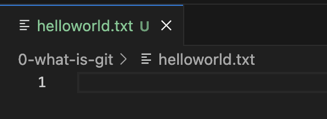
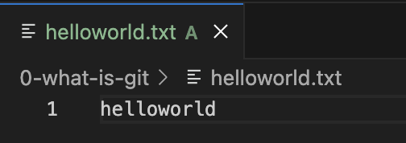
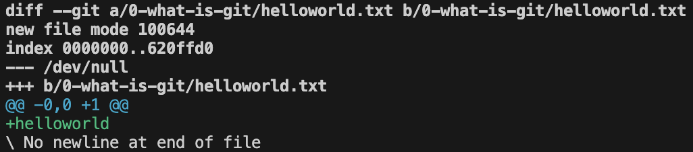

# What is git?
**git** is a version control system
- *What is a Version Control System?*\
essentially a tool for tracking changes made to files to over time. (don't worry about the technicalities just understand this concept)

so in this case git is just an <u>open source version control system where developers can collaborate on projects and manage different "versions" of code</u>.

Example:

- you can image here, we have a <u>main version</u> our codebase, everyone can take that main version and <u>copy it into their own device</u> then <u>make their own changes</u> before adding to the main version which everyone else then can <u>get an updated version of the codebase</u>. It's not as simple as this because we can't just add to the main codebase without checks, but we'll get into that later.

## Why is it important?
Without git or any other version control system, we'd all write code on the same file at the same time or download multiple version of each other's code. Think collaborating on a google doc, but instead code, ye kinda messy.

# Stages of git
To explain this better, we'll go with a simple example of adding the text "hello world" to a helloworld.txt file.
## 1. Untracked
So, we have the initial copy of the file that you're about to make changes to in your directory. Any new file you have in your directory is <u>untracked by git</u>, this also includes any changes you have made to that file. What this basically means is, git is not actively tracking that file & its changes.

Example:\

- here in this example, on vscode untracked files are usually indicated by the <u>U</u> symbol.
## 2. Staged
Now, let's say you added the text "hello world" to your helloworld.txt file, in order to make git track the changes you made, you "<u>stage</u>" it. What that means is you're preparing those changes to be ready for commit. Think of it like moving from working -> work-in-progress.
### git add
To do so, you use `git add`, there's two types of git add:
1. `git add <file name>` - you choose to stage specific files
2. `git add .` - you choose to stage all files with changes you made

typically `git add .` is normally used for most cases, but in case you know you're working on a specific file then use `git add <file name>`

Example:\

- here after running `git add helloworld.txt`, notice the <u>A</u> next to the file name indicting it's been added.
## 3. Commited
Now that you've added your changes and are happy with it, then you can commit it, which basically means moving it from work-in-progress -> you're happy with it.
### git diff
Before you decide to commit, you may want to compare your changes to the original.\
To do this, you can use `git diff --cached`, which will show you the changes you staged.\

* `git diff` without the cache option will show you changes including the ones not staged.
### git commit
To commit, you use `git commit -m "<message>"`\
This means you're committing all the staged files and adding a message of what changes you made.

Example 1:\

- here I ran `git diff --cached`, notice the <u>+helloworld</u> which indicates that I added that text, if I were to remove something it would show <u>-whatever i removed</u> (highlighted in red).